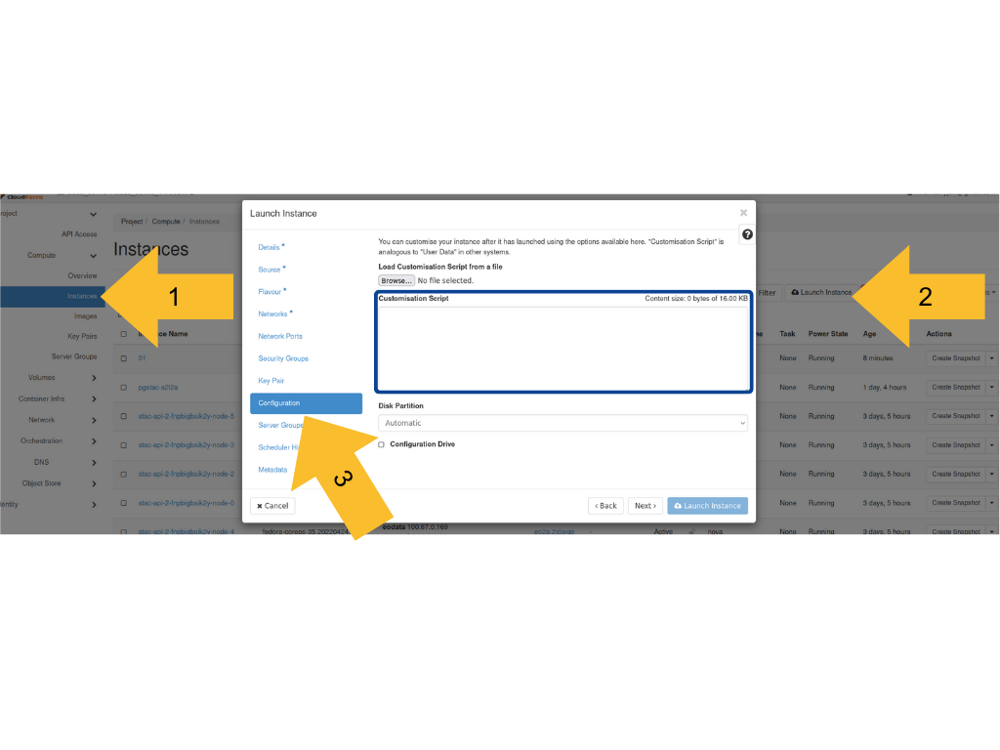

# creodias-customisation-script-pgstac
Fast deployment of pgstac (via docker) and pypgstac (via pip) on CREODIAS infrastructure

## Customisation Script
You can customise your instance after it has launched using the options available here. "Customisation Script" is analogous to "User Data" in other systems.

```console
#!/bin/bash
# Update the package list
apt-get update

# Install nano
apt install -y nano

# Install required packages with automatic yes
apt-get install -y ca-certificates curl

# Create the directory for Docker keyrings
install -y -m 0755 -d /etc/apt/keyrings

# Download the Docker GPG key
curl -fsSL https://download.docker.com/linux/ubuntu/gpg -o /etc/apt/keyrings/docker.asc

# Ensure the keyring file is readable
chmod a+r /etc/apt/keyrings/docker.asc

# Add Docker repository to APT sources
echo "deb [arch=$(dpkg --print-architecture) signed-by=/etc/apt/keyrings/docker.asc] https://download.docker.com/linux/ubuntu \
$(. /etc/os-release && echo "$VERSION_CODENAME") stable" | tee /etc/apt/sources.list.d/docker.list > /dev/null

# Update the package list again
apt-get -y update

# Install Docker components with automatic yes
apt-get install -y docker-ce docker-ce-cli containerd.io docker-buildx-plugin docker-compose-plugin

# Install pypgstac
python3 -m pip install pypgstac[psycopg]

# Export initial env variables:
# for pypgstsac
export POSTGRES_USER=
export POSTGRES_PASSWORD=
export POSTGRES_DB=
export PGUSER=
export PGPASSWORD=
export PGDATABASE=

export PGHOST=0.0.0.0
export PGPORT=5432

# for docker
export postgres_ram="2g"
export postgres_cpus=2
export POSTGRES_IMAGE="postgis/postgis:17beta3-master"

# let's make sure that we only need to export those only once
echo "export POSTGRES_USER=${POSTGRES_USER}" >> ~/.bashrc
echo "export POSTGRES_PASSWORD=${POSTGRES_PASSWORD}" >> ~/.bashrc
echo "export POSTGRES_DB=${POSTGRES_DB}" >> ~/.bashrc
echo "export PGUSER=${PGUSER}" >> ~/.bashrc
echo "export PGPASSWORD=${PGPASSWORD}" >> ~/.bashrc
echo "export PGDATABASE=${PGDATABASE}" >> ~/.bashrc
echo "export PGHOST=${PGHOST}" >> ~/.bashrc
echo "export PGPORT=${PGPORT}" >> ~/.bashrc

# Reload bashrc to apply new environment variables
source ~/.bashrc

# Run pgstac via installed docker:
docker run -d \
  --name stac-db \
  --restart unless-stopped \
  --memory="${postgres_ram}" \
  --cpus="${postgres_cpus}" \
  -e POSTGRES_USER=${POSTGRES_USER} \
  -e POSTGRES_PASSWORD=${POSTGRES_PASSWORD} \
  -e POSTGRES_DB=${POSTGRES_DB} \
  -e PGUSER=${PGUSER} \
  -e PGPASSWORD=${PGPASSWORD} \
  -e PGDATABASE=${PGDATABASE} \
  -p 5432:5432 \
  -v stac-db-data:/var/lib/postgresql/data \
  ${POSTGRES_IMAGE}

# Base migrations install PgSTAC into a database with no current PgSTAC installation
pypgstac migrate
```
## How to use?
Compile the lunch instance tab as instructed and paste the above code into:

and run VM.
Then connect with VM via SSH or RDP (I recommend X2go) and from temrinal do:
```console
pypgstac load collections https://s3.fra1-2.cloudferro.com/swift/v1/stac-demo/collection-sentinel-2-l1c.json
pypgstac load items https://s3.fra1-2.cloudferro.com/swift/v1/stac-demo/S2B_MSIL1C_20240401T003159_N0510_R002_T11XMK_20240401T003828.json
```
## While using beta versions of postgres:
Yo need to edit ```/usr/local/lib/python3.10/dist-packages/pypgstac/db.py```:
```python
    @property
    def pg_version(self) -> str:
        """Get the current pg version number from a pgstac database."""
        version = self.query_one(
            """
            SHOW server_version;
            """,
        )
        logger.debug(f"PG VERSION: {version}.")
        if isinstance(version, bytes):
            version = version.decode()
        if isinstance(version, str):
            try:
                if int(version.split(".")[0]) < 13:
                    raise Exception("PgSTAC requires PostgreSQL 13+")
                return version
            except ValueError:
                print("Warning: Developer version of PostgreSQL deteced")
                pass
        else:
            if self.connection is not None:
                self.connection.rollback()
            raise Exception("Could not find PG version.")
```

Related ticket -> https://github.com/stac-utils/pgstac/issues/300